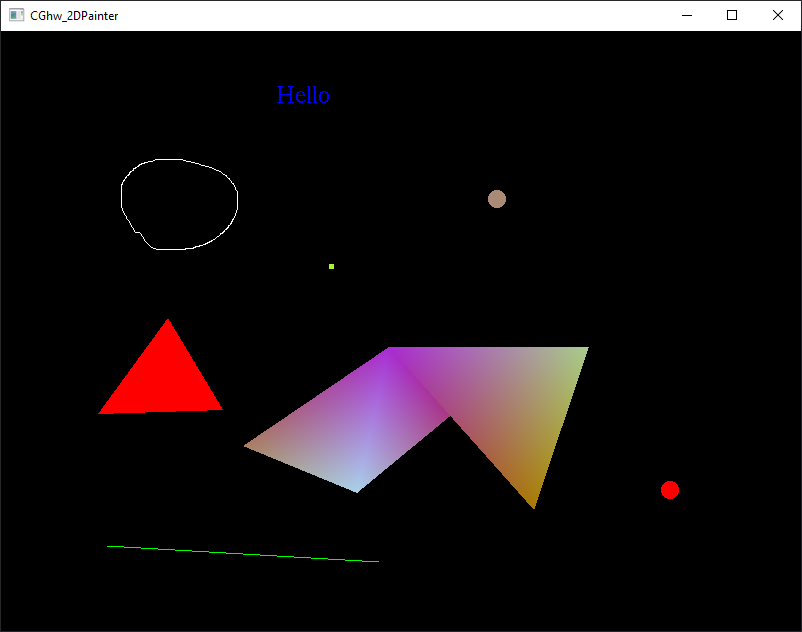
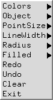
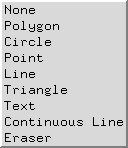

# PREREQUISITES
- vcpkg
- cmake
- set environment variable VCPKG_FEATURE_FLAGS=manifests  

## Basic Painter  
  

## 使用說明  
+ 滑鼠右鍵 - 物品選單
  + 
+ 物件種類
  +   
+ 可透過選單調整顏色、點大小、圓半徑大小等等
+ 利用stack模擬Redo、Undo。